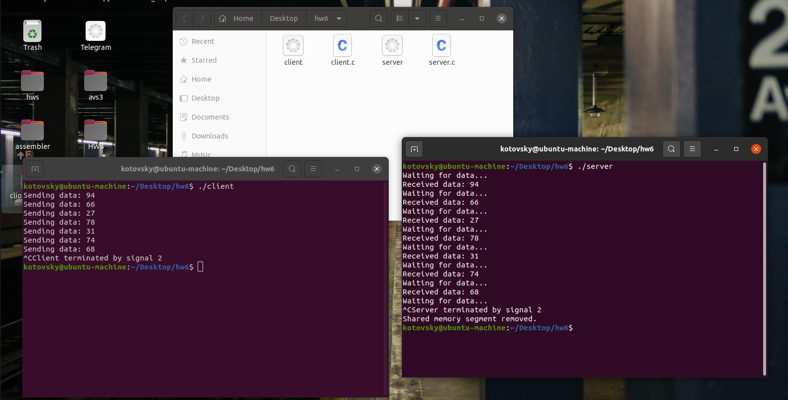

# Домашнее задание № 6.
## Котовский Семён Олегович, БПИ-219

## Обмен данными в общей памяти между клиентской и серверной программами

### Инструкция по запуску:

#### Компиляция программ

1. Откройте терминал и перейдите в папку, содержащую исходный код программ.

2. Скомпилируйте клиентскую программу, выполнив следующую команду:

```gcc client.c -o client```

3. Скомпилируйте серверную программу, выполнив следующую команду:

```gcc server.c -o server```

#### Запуск программ

1. Откройте два терминальных окна.

2. В первом окне запустите серверную программу, выполнив следующую команду:


```./server```

3. Во втором окне запустите клиентскую программу, выполнив следующую команду:
```./client```

Когда вы запустите клиентскую программу, она начнет генерировать случайные числа и записывать их в разделяемую память, которую слушает серверная программа.

Когда серверная программа получит данные из разделяемой памяти, она выведет их на экран.

#### Завершение программ

Чтобы завершить программы, нажмите клавишу Ctrl-C в одном из терминальных окон.

Когда вы нажмете Ctrl-C, программа получит сигнал SIGINT и вызовет функцию обработчика сигнала, чтобы очистить разделяемую память.

После очистки разделяемой памяти обе программы завершатся, и вы сможете закрыть терминальные окна.


В этом проекте мы разработали две программы - клиентскую и серверную - которые взаимодействуют с использованием общей памяти на языке C в системе на базе Unix. Клиентская программа генерирует случайные числа и записывает их в сегмент общей памяти, а серверная программа считывает данные из сегмента общей памяти и выводит их на консоль.
### Логика программы

### Программная логика для клиентской и серверной программ выглядит следующим образом:
### Клиентская программа

Клиентская программа начинает работу с генерации ключа для сегмента общей памяти с помощью функции ftok().

Программа получает сегмент разделяемой памяти с помощью функции shmget() и присоединяет его к адресному пространству клиента с помощью функции shmat().

Программа входит в цикл, генерируя случайное число и записывая его в сегмент разделяемой памяти, используя указатель на сегмент.

Когда программа получает сигнал SIGINT, вызывается функция-обработчик сигнала для отсоединения сегмента разделяемой памяти с помощью функции shmdt() и выхода из программы с помощью exit().

### Серверная программа

Серверная программа начинается с генерации ключа для сегмента разделяемой памяти с помощью функции ftok().

Программа создает сегмент разделяемой памяти с помощью функции shmget() и присоединяет его к адресному пространству сервера с помощью функции shmat().

Программа входит в цикл, ожидая записи данных в сегмент разделяемой памяти, используя указатель на сегмент.

Когда данные доступны, сервер считывает их и выводит на консоль.

Когда программа получает сигнал SIGINT, вызывается функция-обработчик сигнала для отсоединения сегмента разделяемой памяти с помощью shmdt() и удаления его из системы с помощью shmctl(). Затем серверная программа завершается с помощью exit().

### Процесс завершения

Клиентская и серверная программы запускаются отдельно в двух терминальных окнах.

Клиентская программа генерирует случайные числа и записывает их в сегмент общей памяти, а серверная программа ожидает записи данных в сегмент и выводит их на консоль.

Чтобы прервать работу программ, пользователь нажимает Ctrl-C в любом из терминальных окон, чтобы послать программам сигнал SIGINT.

Когда клиентская программа получает сигнал SIGINT, вызывается функция обработчика сигнала для отсоединения сегмента общей памяти с помощью shmdt() и выхода из программы с помощью exit(). Серверная программа продолжает работать.

Когда серверная программа получает сигнал SIGINT, вызывается функция-обработчик сигнала для отсоединения сегмента разделяемой памяти с помощью shmdt() и удаления его из системы с помощью shmctl(). Затем серверная программа завершает работу с помощью exit().

После очистки всех сегментов общей памяти обе программы завершают работу изящно, предотвращая утечки памяти или другие проблемы, которые могут возникнуть при неправильном завершении программы.

### Примеры альтернативного завершения программ:
1. Использование функции atexit()

В этом методе мы используем функцию atexit(), чтобы зарегистрировать функцию обработчика, которая будет вызвана при 
завершении программы. В этой функции мы вызываем функцию shmdt() для отсоединения разделяемой памяти и функцию shmctl() для удаления сегмента разделяемой памяти.

```c
#include <stdlib.h>
#include <stdio.h>
#include <sys/shm.h>

int shmid;
int *shmaddr;

void cleanup() {
    shmdt(shmaddr);
    shmctl(shmid, IPC_RMID, NULL);
}

int main() {
    key_t key = ftok("file", 'R');
    shmid = shmget(key, sizeof(int), 0644 | IPC_CREAT);
    shmaddr = shmat(shmid, (void *)0, 0);

    atexit(cleanup);

    /* остальной код */
}
```

2. Использование функции exit()

В этом методе мы используем функцию exit() для завершения программы и очистки разделяемой памяти. В функции обработчика сигнала мы устанавливаем флаг, который указывает, 
что произошел сигнал завершения, и затем вызываем функцию exit().

```c
#include <stdio.h>
#include <stdlib.h>
#include <signal.h>
#include <sys/shm.h>

int shmid;
int *shmaddr;
int exit_flag = 0;

void signal_handler(int signum) {
    if (signum == SIGINT) {
        exit_flag = 1;
        exit(0);
    }
}

int main() {
    signal(SIGINT, signal_handler);

    key_t key = ftok("file", 'R');
    shmid = shmget(key, sizeof(int), 0644 | IPC_CREAT);
    shmaddr = shmat(shmid, (void *)0, 0);

    while (!exit_flag) {
        /* остальной код */
    }

    shmdt(shmaddr);
    shmctl(shmid, IPC_RMID, NULL);

    return 0;
}
```

### Пример работы программы:

